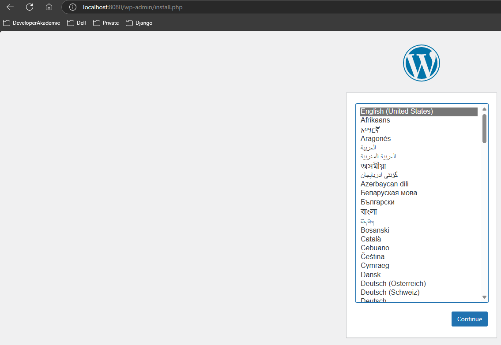
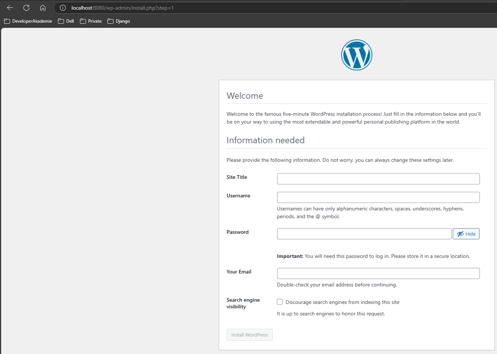
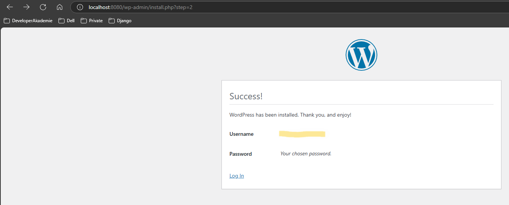
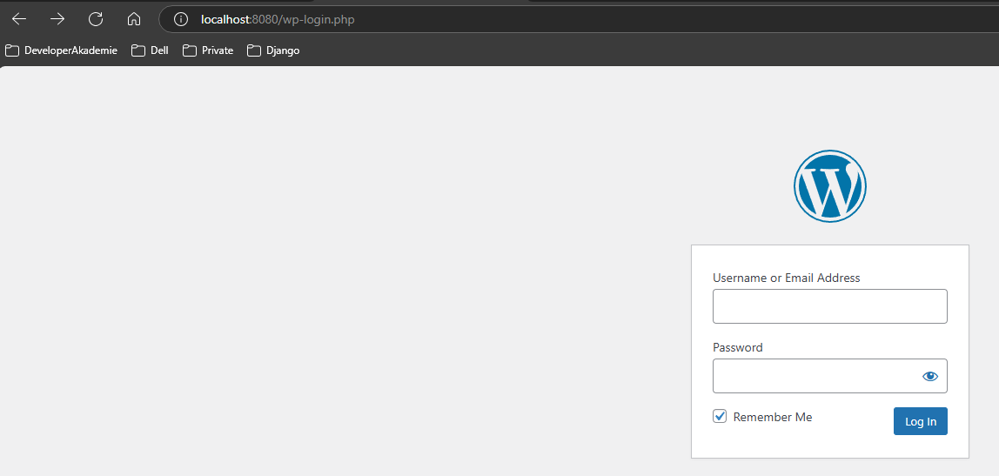
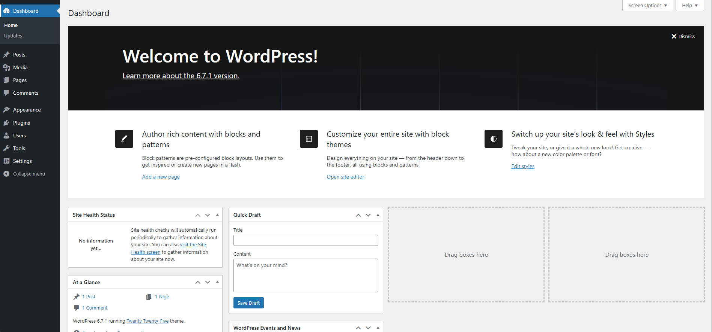

# Wordpress

This is a multi-container setup of a wordpress page using docker compose. It aims to demonstrate how easy it is to setup a wordpress website using only docker and docker-compose.

WordPress is a popular open-source content management system (CMS) that allows users to create and manage websites easily, including blogs, online stores, and business sites. It offers customizable themes, plugins, and a user-friendly interface, making it suitable for beginners and developers alike.

---

## Table of contents

- [Dependencies](#dependencies)
- [Quick start](#quick-start)
- [Structure](#structure)

---

## Dependencies

- **Docker**
- **Docker-Compose**

---

## Quick start

1. Clone repository

    ```bash
    git clone https://github.com/mihaiandreineacsu/wordpress.git
    ```

1. Navigate to project folder

    ```bash
    cd wordpress
    ```

1. Create your `.env` file by copying [`template.env`](./template.env) with the command `cp template.env .env`

    > [!IMPORTANT] Replace the default values with more secured ones in the `.env` file.

1. Start application

    ```bash
    docker-compose up -d
    ```

1. Complete wordpress installation

    - Open the wordpress page via **http://<your_ip>:<your_port>**.
    - Select the language you prefer and press `Continue`.
        
        > [!NOTE] The language can be changed afterwards in Wordpress settings.
    - Fill up the form and click `Install Wordpress`.
        
    - Processed to login by pressing `Log in`.
        
    - Login with your username and password.
        
    - Congratulations finishing wordpress setup. Now you should see the Dashboard of your Wordpress Admin Panel.
        

---

## Structure

- [docker-compose.yaml](./docker-compose.yaml): Defines two services and volumes, **wordpress** and **db**.

  **wordpress** service:
  - Uses the [wordpress](https://hub.docker.com/_/wordpress) docker image.
  - It binds the host port `8080` to container port `80`.
  - Defines the wordpress database environment variables `WORDPRESS_DB_HOST`, `WORDPRESS_DB_USER`, `WORDPRESS_DB_PASSWORD`, `WORDPRESS_DB_NAME`.
  - Binds `/var/www/html` to **wordpress** volume.
  - Depends on **db** service.
  - Restarts always.

  **db** service:
  - Uses the [mysql](https://hub.docker.com/_/mysql/) docker image, version 8.0.
  - Defines the database environment variables `MYSQL_DATABASE`, `MYSQL_USER`, `MYSQL_PASSWORD`, `MYSQL_RANDOM_ROOT_PASSWORD`.
  - Binds `/var/lib/mysql` to **db** volume.
  - Restarts always.

- [template.env](./template.env): Contains environment variables required by the **wordpress** and **db** service.